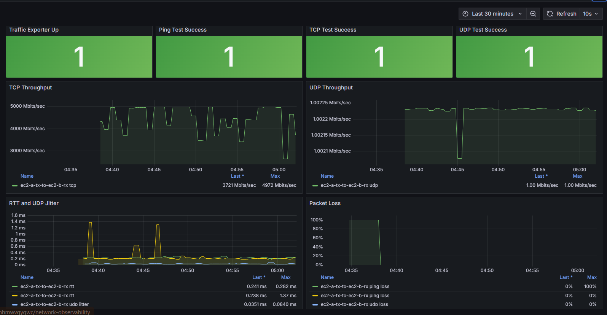
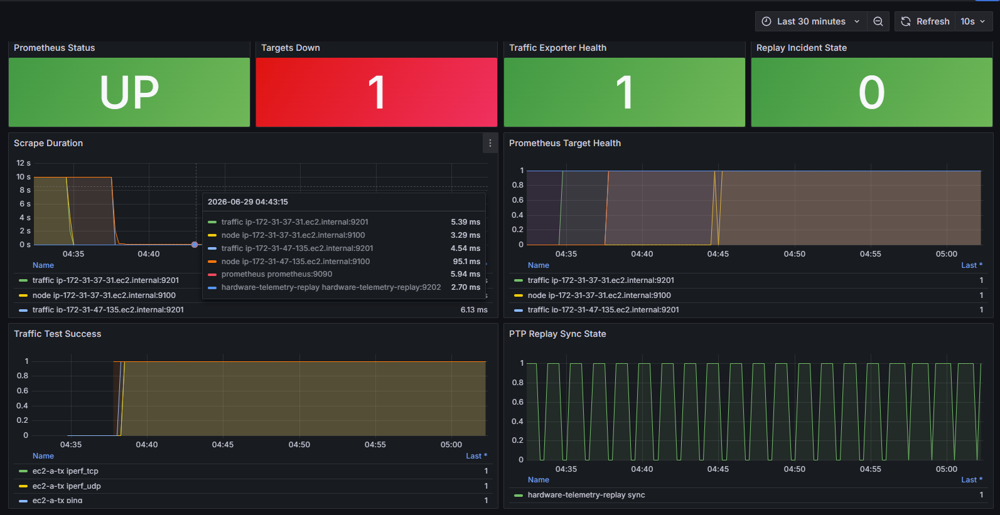
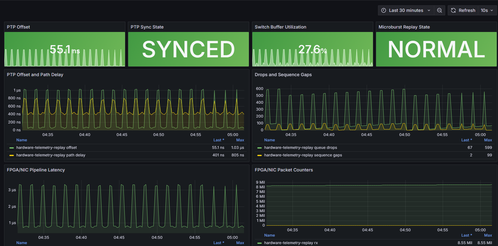
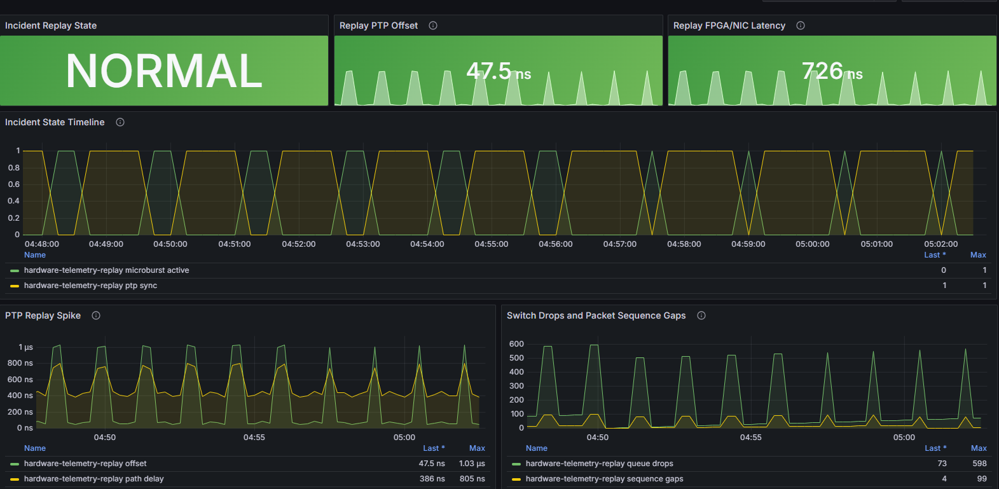

# Low-Latency Telemetry Engine

A reproducible Grafana/Prometheus low-latency observability lab across EC2 Linux nodes. Implemented custom Python exporters for TCP/UDP throughput, RTT latency, UDP jitter/loss, Linux host metrics, and replayed hardware-style telemetry for PTP offset, switch drops, microbursts, and FPGA/NIC pipeline latency. Deployed Grafana behind an HTTPS Nginx reverse proxy, provisioned dashboards, and validated Prometheus scrape health across traffic and observability nodes.


[Live Grafana Demo](https://obs.zetaslate.com)



---

## Dashboards

---

### Platform Overview

The Platform Overview dashboard shows whether the observability platform is healthy. It tracks Prometheus target health, exporter status, and traffic test success.

Live Link: [Open Platform Overview](https://obs.zetaslate.com/d/platform-overview/platform-overview?orgId=1&from=now-30m&to=now&timezone=browser&refresh=10s)



### Two-Node Traffic Lab

The Two-Node Traffic Lab dashboard shows live TX → RX network behavior, including TCP throughput, UDP throughput, UDP jitter, UDP loss, RTT latency, and ping loss.

Live Link: [Open Two-Node Traffic Lab](https://obs.zetaslate.com/d/two-node-traffic-lab/two-node-traffic-lab?orgId=1&from=now-30m&to=now&timezone=browser&refresh=10s)


### PTP / Switch / FPGA Telemetry

The hardware telemetry dashboard replays hardware-style metrics that are commonly important in low-latency systems, including PTP offset, switch microbursts, queue drops, and FPGA/NIC pipeline latency.

Live Link: [Open PTP / Switch / FPGA Telemetry](https://obs.zetaslate.com/d/hardware-telemetry/ptp-switch-fpga-telemetry?orgId=1&from=now-30m&to=now&timezone=browser&refresh=10s)



### Incident Replay

The Incident Replay dashboard shows a simulated incident timeline where latency, PTP offset, switch drops, microbursts, and FPGA/NIC pipeline latency move together.

Live Link: [Open Incident Replay](https://obs.zetaslate.com/d/incident-replay/incident-replay?orgId=1&from=now-15m&to=now&timezone=browser&refresh=5s)



---

## What This Project Demonstrates

This project demonstrates a practical observability workflow for low-latency systems:

- Real EC2-to-EC2 TCP throughput testing with `iperf3`
- Real EC2-to-EC2 UDP throughput testing with `iperf3`
- UDP jitter and packet-loss measurement
- RTT latency and ICMP packet-loss measurement
- Linux host metrics through `node_exporter`
- Custom Python Prometheus exporters
- Replayed hardware-style telemetry for PTP, switch, and FPGA/NIC behavior
- Grafana dashboards provisioned as code
- Prometheus scrape configuration generated from environment variables
- Public HTTPS Grafana access through an Nginx reverse proxy

---

## Architecture

```text

Architecture

                         ┌────────────────────────────┐
                         │        Browser / User      │
                         │  https://obs.zetaslate.com │
                         └──────────────┬─────────────┘
                                        │ HTTPS
                                        ▼
                         ┌────────────────────────────┐
                         │         main-nginx         │
                         │  Public HTTPS reverse proxy│
                         │  Amazon Linux 2023         │
                         │  Public IP: 3.94.249.5     │
                         └──────────────┬─────────────┘
                                        │ Private VPC proxy
                                        │ http://X.X.M.M:3000
                                        ▼
┌─────────────────────────────────────────────────────────────────────────────┐
│                                  ec2-obs Ubuntu                             │
│                           Observability Node                                │
│                         Private IP: X.X.W.W                                 │
│                                                                             │
│   ┌─────────────────────┐        ┌─────────────────────┐                    │
│   │       Grafana       │◄──────►│     Prometheus      │                    │
│   │       :3000         │        │       :9090         │                    │
│   └─────────────────────┘        └──────────┬──────────┘                    │
│                                             │                               │
│   ┌─────────────────────────────────────────┘                               │
│   │                                                                         │
│   ▼                                                                         │
│   ┌──────────────────────────────────────┐                                  │
│   │ hardware-telemetry-replay exporter   │                                  │
│   │ :9202                                │                                  │
│   │ Replayed PTP / switch / FPGA metrics │                                  │
│   └──────────────────────────────────────┘                                  │
└─────────────────────────────────────────────────────────────────────────────┘
                                              │
                                              │ Prometheus scrapes
                                              │
                ┌─────────────────────────────┼─────────────────────────────┐
                │                             │                             │
                ▼                             ▼                             ▼

┌──────────────────────────────────────┐                         ┌──────────────────────────────────────┐
│              ec2-a-tx                │                         │               ec2-b-rx               │
│            Traffic Sender            │                         │            Traffic Receiver          │
│       Private IP: X.X.Y.Y            │                         │        Private IP: X.X.Z.Z           │
│                                      │                         │                                      │
│  ┌────────────────────────────────┐  │                         │  ┌────────────────────────────────┐  │
│  │ node_exporter                  │  │◄──── scrape :9100 ─────►│  │ node_exporter                  │  │
│  │ Linux host metrics             │  │                         │  │ Linux host metrics             │  │
│  │ :9100                          │  │                         │  │ :9100                          │  │
│  └────────────────────────────────┘  │                         │  └────────────────────────────────┘  │
│                                      │                         │                                      │
│  ┌────────────────────────────────┐  │                         │  ┌────────────────────────────────┐  │
│  │ traffic_exporter               │  │◄──── scrape :9201 ─────►│  │ traffic_exporter               │  │
│  │ TCP / UDP / RTT metrics        │  │                         │  │ receiver-side exporter health  │  │
│  │ :9201                          │  │                         │  │ :9201                          │  │
│  └────────────────────────────────┘  │                         │  └────────────────────────────────┘  │
│                                      │                         │                                      │
│  ┌────────────────────────────────┐  │                         │  ┌────────────────────────────────┐  │
│  │ iperf3 client tests            │  │                         │  │ iperf3 server                  │  │
│  │ TCP / UDP sender               │  │                         │  │ :5201                          │  │
│  └───────────────┬────────────────┘  │                         │  └───────────────▲────────────────┘  │
└──────────────────┼───────────────────┘                         └──────────────────┼───────────────────┘
                   │                                                                │
                   ├──────────── TCP iperf3 traffic :5201 ─────────────────────────►│
                   │                                                                │
                   ├──────────── UDP iperf3 traffic :5201 ─────────────────────────►│
                   │                                                                │
                   └──────────── ICMP ping / RTT / packet loss ────────────────────►│

```text

## EC2 Nodes

| Node | Role | Main services |
|---|---|---|
| `ec2-obs` | Observability node | Prometheus, Grafana, hardware telemetry replay exporter |
| `ec2-a-tx` | Traffic sender | `node_exporter`, custom traffic exporter, `iperf3` client tests |
| `ec2-b-rx` | Traffic receiver | `node_exporter`, custom traffic exporter, `iperf3` server |
| `main-nginx` | Public reverse proxy | Dockerized Nginx, Certbot TLS, private proxy to Grafana, Postgres and Django for zetaslate.com

---
## Metrics Collected

| Metric | Meaning |
|---|---|
| `traffic_exporter_up` | Custom traffic exporter health |
| `flow_test_success` | Success status for ping, TCP, and UDP tests |
| `flow_tcp_throughput_mbps` | TCP throughput from TX to RX |
| `flow_udp_throughput_mbps` | UDP throughput from TX to RX |
| `flow_udp_jitter_ms` | UDP jitter from the iperf3 UDP test |
| `flow_udp_loss_percent` | UDP packet loss percentage |
| `flow_rtt_ms` | ICMP round-trip latency |
| `flow_ping_packet_loss_percent` | ICMP packet loss percentage |
| `ptp_offset_ns` | Replayed PTP clock offset |
| `switch_queue_drops_total` | Replayed switch queue drops |
| `packet_microburst_active` | Replayed microburst state |
| `fpga_pipeline_latency_ns` | Replayed FPGA/NIC pipeline latency |
